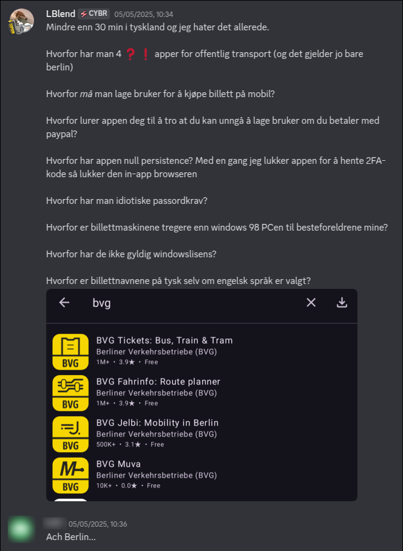
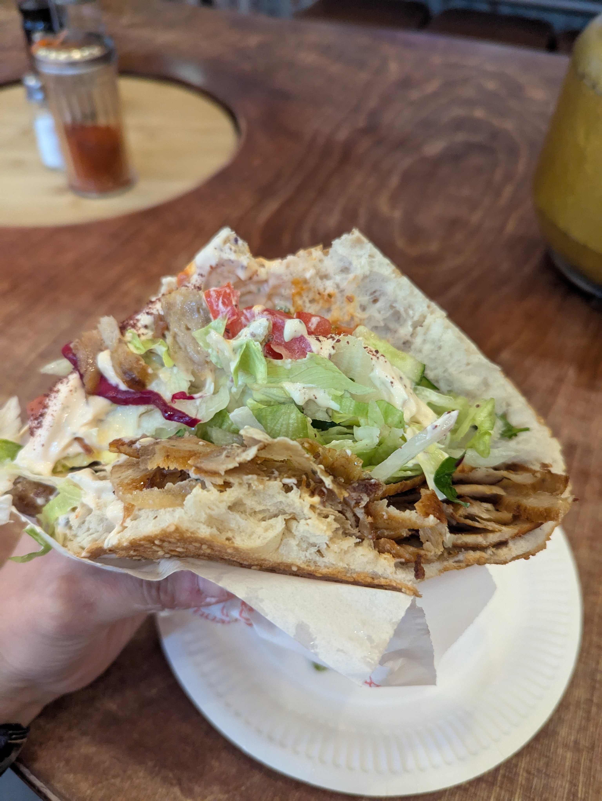
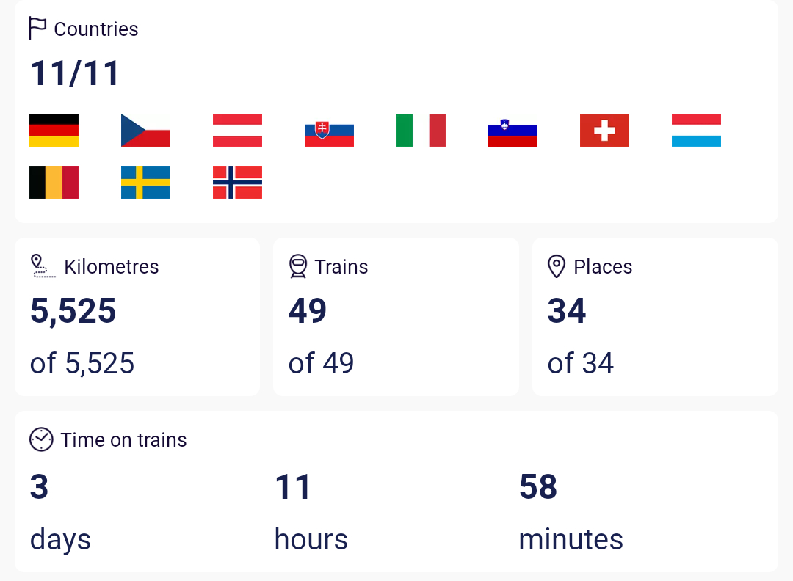

It was a random Monday in April. My 25th birthday was in two days. I had been thinking about going on an Interrail (also known as Eurail) trip in the coming summer, however stars suddenly aligned and I got about 3 weeks of free time in May. This was my chance! In May, there are fewer tourists, no heatwaves, and lower prices overall. I decided to take the opportunity, the catch being that I had to plan the whole trip and leave in just one week.

I did indeed leave the following week, on May 5th, and now I'm writing about my experiences on the go. This sentence is being written on a train from Berlin to Prague.

**UPDATE:** Never mind... turns out that pulling out my shitty laptop from deep inside my backpack all the time was too much of a hassle. Also, not all trains have power outlets or a table.

## Flying to Berlin, Germany 🇩🇪

Wait... isn't this an Interrail trip? Aren't you supposed to go by train? Well yes, but as it turns out, getting out of Scandinavia takes a loooong time. It wouldn't be too bad, but then you have to consider that this time would be near-constant rail travel, meaning I'd get sick of trains before the trip had even really started. I also felt a sense of rush because there were a lot of sights I wanted to see. Since there were cheap tickets available, about 40 american rubles, I decided it was worth it.

Despite Germany being... right there, I had actually never been there. That is, if you don't count the one time I went on a boat trip to Kiel, where I got to roam around in a shopping center for four hours!

### A rant about Berlin's ticketing system

Landing in Berlin, I didn't get a great first impression. I had to get a train ticket from the airport to the city center. I downloaded one of the **FOUR (4)** apps for Berlin's transport system and tried buying a ticket. In order to buy one, you of course needed an _account_, but I didn't want to create an account just to travel around for just _one_ day.

The UI implied that if I paid with PayPal I would not need to make an account. I logged into PayPal within the app but when asked for a 2FA code, I had to exit the app to fetch it. When returning, the in-app browser had closed. I tried doing this 3 times before realizing it was not just a "ran out of RAM or something" situation. I logged into PayPal in the browser, went back to the app and clicked "Log in with PayPal". Everything went smoothly.

Or so I thought...

But nooooo paying with PayPal did not free you from making an account. The only thing it "freed" you from was entering your name and e-mail. Thanks BVG!

Add to that, when giving up and deciding to create an account, I was met with some damn _password requirements_, which as per usual are arbitrary as fuck. Having to either come up with or generate a password that would fit their stupid rules took too much mental capacity, as I was stressed the fuck out. The train was leaving in 3 minutes and the next one wouldn't come for another 25 minutes. I gave up and went to the good ol' ticketing machines.

Naturally, there was a line, and people were taking forever getting their tickets, to my frustration. I later realized why when it was my turn. The machine was awfully slow, running an unlicensed version of windows 10 (yes, you could see the watermark). I eventually got my tickets, about 30 seconds before the train left the station. Safe to say, I was pissed.

I ranted about this to a Norwegian-speaking German I know

### The actual Berlin experience

I did all the touristy stuff. You have seen a million pictures of it already. Yada yada. The good thing is, it's all in proximity of each other, meaning I could just walk to every touristy thing without losing much time. It was all really beautiful, though I never ventured outside the city center into areas where people actually live.

My favorite part was when I lied down on the grass in front of the Berlin Cathedral and just chilled. All while listening to the old British couples argue and the Koreans instruct each other during their 10+ minute long photo-taking sessions. The weather was great, and life was good!

**Side note**: I still don't understand the logic behind the street lights for pedestrians. There's no auditory cue as to whether it just turned green or not, the lights are out of sync meaning you can only cross half the road, and there is now way of telling how long the lights last in their current state. Considering Berlin has a lot of wide multi-lane roads it was kind of frustrating. Along the same lines I also found it funny how the doors on the metro open before the train has even come to a full stop. The doors also slam shut making things look... brutal?

At the end of the day I wanted to eat the most German food there is: the döner. I looked up the highest-rated döner spot in my area on Google Maps and went there. Turns out I had fallen into a TikTok trap. The line was really long, and full of German zoomers. I decided to wait in line since there was only one other döner place in the area, which was inside the train station (didn't sound very promising lmao). After standing in line for about 25 minutes, I discovered that it was cash only. I had for some reason assumed that card was accepted everywhere. I took my losses and went to the other place, which was actually pretty good. So not much was lost.

Overall I clocked in about 26K steps and was pretty exhausted. I got really sunburnt, and my shoulders were sore from carrying my backpack all day. Of course, my legs were sore too. I slept pretty well despite staying in a hostel with an old guy who did not give a single flying fuck about whether or not he woke up the other guests in our room.

## Train to Prague, Czech Republic 🇨🇿

Like Berlin, Prague also had the advantage of having all the touristy "must-see" areas fairly close to each other and yet again I ended up doing just that. It was overall very enjoyable though.

The hostel I stayed at was more social which led to me hanging out for dinner and playing drinking games afterwards. We then went to a karaoke bar, however I was too sober and I generally feel uncomfortable outside of "house parties", so I took an Irish exit (justified by the fact that I had to get up early the next day to catch a train to Vienna). Even though it was just for a couple of hours, I felt very welcome there and had some great conversations with people. Better yet, there was only one other person in my room meaning I actually got some privacy for a change.

## Vienna, Austria 🇦🇹

I then went to Vienna and I must say... wow! It's probably one of the most beautiful cities I've been to if not _the_ most beautiful. I caught myself saying "damn" multiple times while riding the tram through the city.

But it wasn't all sunshine and rainbows. The hostel was fine, but the room I stayed in was awful. It was so hot and humid that I could barely get any sleep. I also noticed things were quite expensive there.

And to top it all off someone tried to scam me in Naschmarkt. A guy insisted that I should try all his nuts and cheeses. I asked what the price was but he ignored me. I asked for a very small amount, after all they were genuinely good, but when I was about to pay I saw that the price was the equivalent of €80 per kilo!

I backed out and he started swearing at me and calling me slurs. So that was fun...

In other news, I encountered this party tram. I kinda regret not hopping on.

import partyTram from "./assets/party_tram.mp4";

<video class="my-2 rounded-md" as="video" width="100%" src={partyTram} playsinline controls />

## Bratislava, Slovakia 🇸🇰

I initially hadn’t planned to go there, but I realized I had more time to spare than I originally thought.

My first impression wasn't great. Outside the train station there were lots of homeless people shouting at each other and you could clearly sense that the GDP was well... lower. Maybe I was being too harsh since I had just come from Vienna. However, as I walked the city I found it to be quite nice.

I went to sleep early to catch an early train to Salzburg the next day. A couple of hours later, I was woken up by another guest who had been to the pub crawl (that I had skipped). He was as drunk as you can get without blacking out, and naturally, he was very noisy. That is to be expected since it's a hostel so I didn't mind it too much. Suddenly though, he started vomiting all over the floor and kept doing so on and off for about 2 hours. Needless to say, I didn't sleep well that night. What was worse though, was that he somehow managed to puke on backpack as well. I didn't notice until the morning. so I had to in a rush try to clean it with toilet paper and soap. Not the best start to my day...

I want to mention that I really liked the dish I got served at a restaurant I went to. My expectations were low so I was pleasantly surprised. I do think I went to a restaurant catered towards tourists though.

## Salzburg, Austria 🇦🇹

I think by this point, I had already kind of burned myself out. I felt exhausted, and the weather being shitty didn't help. It was also the first point of the trip where good weather was kind of crucial as I had planned to go up into the mountains. That plan failed due to the overcast skies.

Salzburg itself was _fine_ as a city, nothing too special. I decided to take it easy and enjoyed some good food.

## Night train to Venice, Italy 🇮🇹

My first night train experience! And uhh... it could have been better. I did not book a bed so I had to sleep in an upright position. I dozed off in 15 minute intervals or so every now and then but didn't really feel like I got any sleep in general. It check out with my theory that I can't sleep while sitting since I can't sleep on airplanes either.

I eventually reached Venice and was met with having to pay just to enter the city. The more I think about it, I think it's fair considering the amount of tourists that come and go, making it unlivable for the locals.

Although Venice is a tourist hell hole it wasn't too bad. There weren't a lot of tourists in the morning so I got to actually see all the sites. It's beautiful so I get why it's a popular destination.

I ended up ordering some take away pizza and sitting by one of the canals.

## Turning around for Ljubljana, Slovenia 🇸🇮

So on a whim I decided to go to Slovenia. I still had more time than I initially realized so I went back the other way just to check off Slovenia. It had a similar vibe to Slovakia. Not much going on but quite cozy, featuring a castle in the middle of the city as well.

I was fidgeting with some coins in my pocket while walking down the street. Suddenly there was a man right in front of me with his hat reached out towards me. Without even thinking about it I just put the coins in his hat. It's what he wanted anyway but normally I would ignore such things. That's -0.40 EUR to my name I guess :P

## Back to Venice (the outer city) 🇮🇹

I was planning on going to lake Garda the next day and had to get somewhere fairly close, so I stayed the night in Venice. As per usual in Italy you get weird scammers trying to scam you in new and interesting ways. _Sigh_

## Lake Garda, Italy 🇮🇹

The plan was doing both Garda and Como in a single day but I had lots of time to spare and ended up sleeping on the beach at Garda for a bit during the day. I later found out I had to spread it over two days anyway since there were no trains between Italy to Switzerland the day I was planning to leave, meaning I had an extra day to kill off time.

There were a lot of ducks and swans there. Some tourists came along and let their child pet the swan. The parent did not give a single fuck. I was ready to see a little kid get attacked but he luckily didn't. It seems like the swans in Garda are really used to human interaction. It did not react well to other animals however. There was couple that walked past with their dog and this time it started making hissing noises towards it. I was once again ready to witness an attack but alas it didn't happen.

One thing I haven't mentioned is that I brought a drone. For the first time during this trip I was outside a major populated area, so I got to try it out. I didn't want to bother anyone else though so I couldn't fly as close to interesting subjects as I wanted to.

## Milano, Italy 🇮🇹

I think I hate Italian cities.

I did not feel safe there. I also booked a hostel that had no reviews and I was probably one of their first guests. It was just some random guy who had turned his apartment into a "hostel". I had to download a fucking app just to unlock the doors as there was no reception. I never even met anyone as there were no other guests either. On one hand it was quite nice to have some privacy but I also felt uneasy about the whole thing as it seemed sketchy.

In spite of this I got to relax and take it easy, using it as a hub while visiting Garda and Como.

## Lake Como, Italy 🇮🇹

There were lot more tourists there. It reminded me a lot of the nature in western Norway. It was generally pretty beautiful. Not much more to say about it though.

## Train from Tirano (Italy) 🇮🇹 to Chur (Switzerland) 🇨🇭

I took an early morning train to Tirano where I would transfer to a train that would take me through the Bernina pass. No it is not the expensive bernina express but rather the local line that mostly goes the same route. And I must say it is the most beautiful train ride I've ever ridden. Truly stunning! I recommend anyone going to Switzerland to consider riding this line.

Once again I got to use my drone and captured this footage (majorily scaled down for the blog). Hopefully I didn't bother anyone.

import drone from "./assets/drone_switzerland.mp4";

<video class="my-2 rounded-md" as="video" width="100%" src={drone} playsinline controls muted />

Sky got overblown. Skill issue :(

I eventually arrived in Chur. Pretty nice place but not much special going on.

## Liechtenstein 🇱🇮

I was on an any% run on visiting every European country that I hadn't been to yet, which of course includes little Liechtenstein.

I can't say it's the most exciting place in the world. It's just Switzerland with extra steps. It had very much the vibe of being a place for rich people. If you're Norwegian, you probably know the "Frognerfrue" archetype. That stereotype could be applied to every person I ran into there.

I walked around most of the few spots they had and visited the border, with each foot planted in each country at the same time. I contemplated visiting the "middle point of Liechtenstein" as it didn't look too far away from where I was on the map. However, the middle point was on a steep mountain I wasn't too keen on climbing.

Unlike all the other countries I had visited this far I did not get to go to a grocery store nor a McDonald's to check out their selection, which is a part my routine (Capitalism-maxxing 🥰). I would guess it's they have exact same as Switzerland though.

## Lucerne/Mt. Pilatus, Switzerland 🇨🇭

Next up was Lucerne/Luzern. Beautiful city! I found an [extensive guide on Reddit](https://www.reddit.com/r/ali_on_switzerland/comments/afin8w/my_guide_to_luzern_lucerne_switzerland/) that included a walking route. I ended up using that a lot.

So I have this thing going on where I take a picture of a rat plushie at each location I go to. While taking pictures of the famous bridge in Lucerne I had tied it to the railing by its tail. I had to wait to take my pictures as there was another group of tourists in front of me, which was when the tie unloosened and the rat fell in to the river :(
Hoping that the stream would flow it down the river to a spot where I could reach it, I waited for a while. The stream was basically non-existent though, meaning that I had to try fishing it out of the river myself. I had no gear so I had to get creative. I tied 2 USB-C cables to each other and plugged it into my power brick. It did not work all that well and I gained quite a few spectators along the way. Eventually a random fisher came by and helped me retrieve the rat. I would not be surprised if there's a video of the whole ordeal online somewhere.

At the hostel I slept with the loudest snorer I have ever encountered. Luckily I don't have much trouble sleeping through loud noise, as long as I am lying down :)

The next day I went to Mt. Pilatus. A really nice couple I had run into at the hostel was going there too and we ended up running into each other a few times there. I also ran into a family of four on the way there, which I got really well along with. These are some of the best moments of travelling for me, connecting with people, even if it's just for a short moment or two.

Anyway, Mt. Pilatus was stunning and it was crazy to think this was basically at the same altitude as Norway's tallest mountain. Though a bit pricey since I took a cog wheel train up there, it was well worth it. Especially considering I got that high up without my fat ass needing to hike at all.

## Interlaken/Kandersteg/Oeschinensee, Switzerland 🇨🇭

Interlaken itself is not that interesting of a place. It does have the really vibrant light blue lakes on each side of it, however for me it was more used as as hub to go to other places in Jungfrau.

On the way there I tried my hand on using the little Korean I knew after my exchange stay two years earlier. There was a couple around my age next to me on the train trying to take photos out of the window. I had the window seat so I offered to give it up so they could get better pictures. They were clearly confused at first hearing some random guy speak Korean to them, but it was a nice ice breaker and we ended up talking for a bit. I came out of the conversation a bit disappointed in myself though. My listening skills were adequate but I really struggled to express myself well/in a smooth manner. I guess a little nervousness played a role but for the most part it was a lack of previous output practice.

The following day I went to Kandersteg, rode the toboggan (with no photos or videos since I wasn't allowed to film) as well as visiting Oeschinensee. I wasn't too impressed with the latter but I think it was for the most part due to the weather. It was overcast and the lake looked really gray.

## Zermatt/Matterhorn, Switzerland 🇨🇭

I don't know how I feel about this place. I paid 5x the price to stay here compared to the previous places I had stayed at, and I didn't even get my own room. It was still a hostel-style accommodation. Though clearly nicer than the other places I had stayed, it wasn't worth it. I was also the only person under the age of 40 there.

I got to see the Matterhorn, naturally but that's about it. Unless you're a hiker there's not much going on here. And I am sure as hell no hiker. Not with my over-packed backpack and non-athletic physique.

## Luxembourg 🇱🇺

This might be the most bland and boring place of the trip. Yes there were some nice castles and shit but other than that it wasn't something I hadn't seen before during the trip. The prices were even higher than Switzerland. That is, except for the accommodation due to the lack of tourists. I would not go here unless you just want to check it off as visited for the sake of having been there.

Only good thing I can say about this place is that they had free public transit, and there was free Wi-Fi in the city center. Well as long as you have access to the [Eduroam](https://en.wikipedia.org/wiki/Eduroam) network that is.

## Ghent, Belgium 🇧🇪

Ghent was overwhelmingly impressive, and it exceeded my expectations. Though small, it had nice architecture and canals. Being in Flanders (Netherlands 2.0}, it also had a broad selection of banger (mostly fried) foods. I ate a lot during my stay here. All progress I had made towards losing weight in Switzerland due to me not eating a lot because of the prices, was instantly erased.

A friend of mine that had lived there gave me a lot of good recommendations and I ended up enjoying it a lot. I drank all the beer and ate all the food there was to offer!

The view from the hostel was also really nice:

## Antwerp, Belgium 🇧🇪

Antwerp was in some ways more of less the same. Good food and some nice architecture. It was bigger than Ghent but didn't have the canals. Less cozy in my opinion.

I didn't do too much here, but I did some shopping for a change. Walking down the street I found a lot of interesting stores and ended up buying some stuff. Though I couldn't buy too much because it wouldn't fit in my backpack. It was generally a good time for shopping since I now didn't have to carry around all the stuff for too long before returning home.

At the hostel I got told off by some German guy for not wearing shoes, even though we were inside. I get his point since most people wore shoes in there but I don't know why he was so serious about it. He threatened to tell the staff and have me kicked out before I even got the time to respond.

## Hamburg, Germany 🇩🇪

I took it easy in Hamburg and didn't stress about seeing the sites at all.

I did book a tour at the Airbus factory but I can't say I was too impressed. Everything felt very chaotic and our guide just spoke about random stuff he knew after working there for about 30 years. He didn't speak English that well so you could tell it was hard for him to express himself. Though it was cool to see some of the different facilities we didn't get to see anything in depth. In general the rules were pretty strict. It is understandable but it kind of ruined the experience nonetheless. I would've liked to actually enter an aircraft and have them talk about it in depth, but alas we didn't.

On my way back to the hostel I ran into a huge crowd that had gathered around a crime scene. There had been a [mass stabbing event](https://en.wikipedia.org/wiki/2025_Hamburg_stabbing_attack) just 20 minutes earlier. Hadn't I taken the wrong bus, I likely would have been there to witness (or be a victim) of the event. It's kind of crazy to think about!

import stabbing from "./assets/hamburg_stabbing_aftermath.mp4";

<video class="my-2 rounded-md" as="video" width="100%" src={stabbing} playsinline controls />

Side note: Hamburg was very car-centric. It was pretty annoying to walk around there.

## Home sweet home! 🇳🇴🏠

Then began the long journey home. A part of me wanted to fly home but my ticket was still valid so I felt the need to use it. This means that it would take me about 16 hours to get home from Hamburg.

I took the night train from Hamburg to Malmö, which took about 7 hours. The train left at midnight meaning I had the chance to sleep. But once again I only managed to doze off a little bit here and there. Next I took the train from Malmö to Gothenburg and then from there to Oslo. It was definitely and exhausting journey but I was finally home! Despite all the fun adventures it felt good to be back!

## Conclusion

Here are the statistics for my trip:

_Do note that the app considers the station in Liechtenstein to be Austrian, probably because the trains are operated by the Austrian rail service._

Overall it was a great experience! I got see so many places, maybe too many. The whole trip is all kind of a blur for me to be honest. You do not realize what you're experiencing in the moment so you kind of fail to appreciate it all. Even though I was on my own and had complete free will, I felt a certain obligation to see the sites, to go to places I personally don't find that interesting as well as taking pictures of things I don't really care about. It's interesting how I went auto-pilot mode throughout most of the trip.

If I ever go on another solo trip I want to give myself more time to just relax and/or time to attend social events at the hostels. I also want to spend less money on eating out as it's generally not worth it in the long run. Though I liked not having a detailed plan, I wish I had a rough idea of things I wanted to see in a place/city before going there. After a full day of exploring, having to book things and researching what to do the following day got kind of exhausting in the long run.

### Some lessons learned

- There are benefits to booking in advance but generally you are fine booking things the day before.
- There will always be 1 person at a hostel that ruins the experience for the rest. Doesn't matter if you are in 4-bed shared room or a 16-bed one, it will _always_ be the case.
- Food is expensive everywhere now. It wasn't too different from Norway.
- A surprising amount of places charge you for going to the toilet. Do it on the train if you can.
- You do not need to reserve seats during May, even when the Interrail app says so. Not once did I have trouble finding a place to sit.

Now we look forward to the next trip! Where? I don't know yet but we'll see 👀
