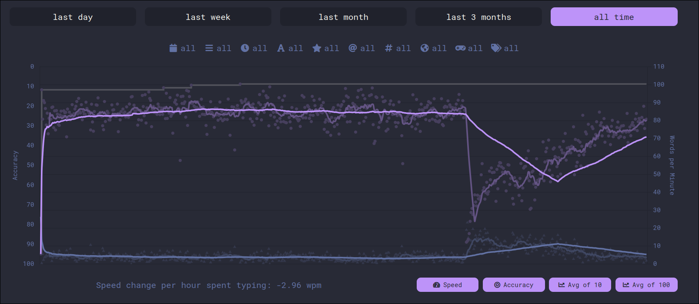
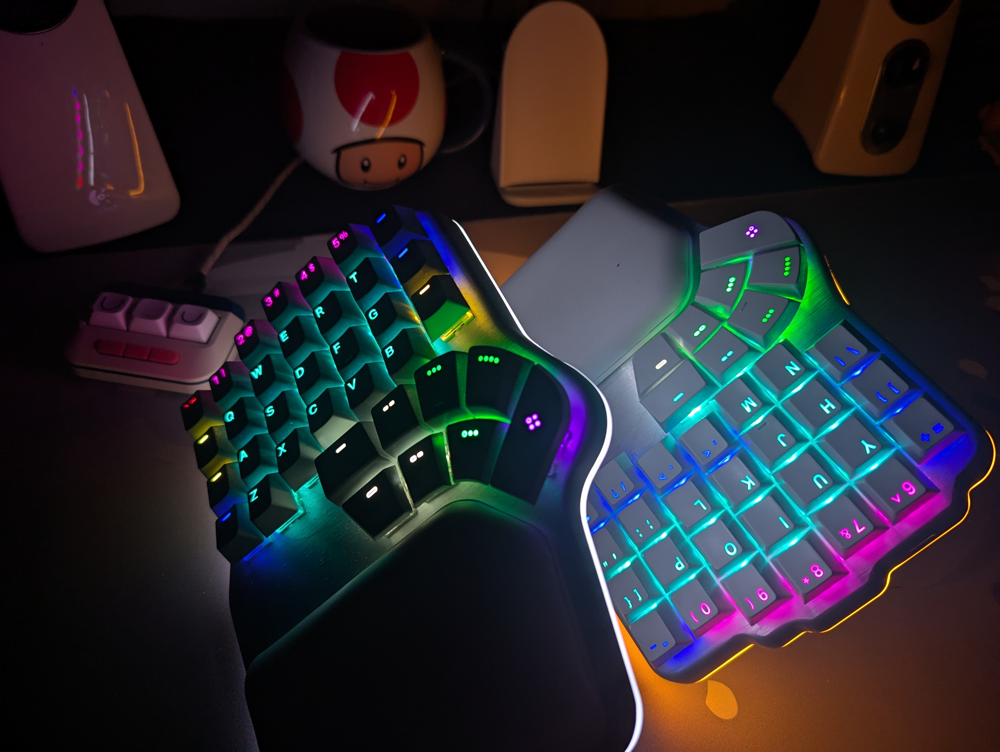
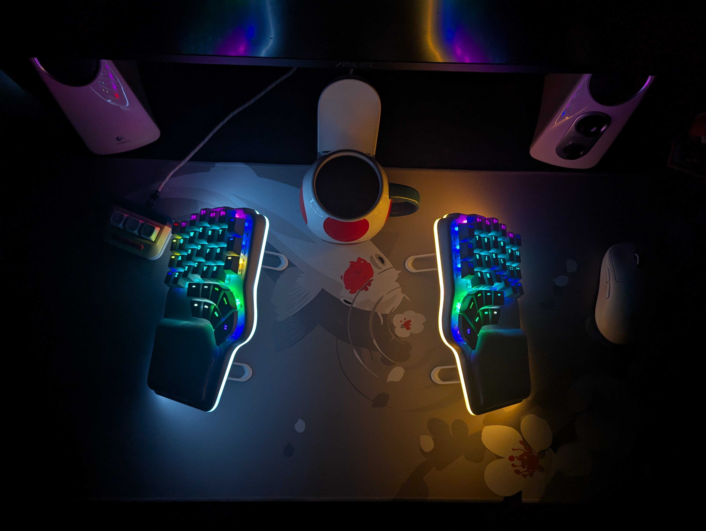

In August 2024, I got my first "adult-job". That is to say, I got my first full-time job with no end-of-contract. With an adult-job comes adult-money... which I could spend irresponsibly.

## Backstory - Why did I want a split keyboard?

In June 2023, before I had adult-money to spend on shit I don't need, I watched a [YouTube video](https://www.youtube.com/watch?v=pK41Mr4Kdd0) about someone's journey through the world of keyboards. The guy in the video ended up trying a lot of different split keyboards. Though I had been interested in getting into the custom keyboard scene for a while at that point, I had never really considered split keyboards.

And from that point onward, **an idea** had been planted in my head. As much as I hate to admit it, I had been _influenced_. Not in the traditional sense where I was swayed to buy a specific product from a specific brand, but rather the idea of buying a split keyboard - something I didn't really need at all.

I started looking at different options, researching switches, key caps, ergonomics etc. The limiting factor in the end though was the budget. I considered going for one of the cheaper options but never went any further with it.

## The tipping point

Over a year passed and I had kind of forgotten about keyboards. However, one day I went to a LAN event and saw that someone had one of the keyboards I had considered buying. I finally got to try it IRL and had a lot of my concerns addressed. One of these concerns was the tenting. I was worried that my hands would slide off when tenting at too sharp of an angle. However this was not the case. Another concern I had was the thumb cluster. It was hard for me to tell whether or not I could comfortably reach all the keys. Luckily I could.

Anyways for me this was the tipping point, and now that I had money to spend, I decided that I was gonna buy my first split keyboard.

## Buying the keyboard

The keyboard I decided to buy was the [Dygma Defy](https://dygma.com/pages/defy). One thing I had forgotten about however was that back when I looked at this keyboard, it was in its pre-order phase, which had a discount attached to it.

The price had increased, but the keyboard ticked all my boxes. I excused it as an "investment" into my health since I now worked full time as a programmer and "need" an ergonomic keyboard. This in spite of the fact that I haven't had any issues with wrist pain or anything of that sort (except when playing a lot of osu!).

I had some considerations to make before buying the keyboard though:

- Should I really spend $70 USD on the tenting kit, which is essentially a couple pieces of plastic? That seems absurd!
- Do I really need RGB underglow? Yeah it looks cool but it's not like I look at my keyboard anyway.
- Import fees and taxes! Do I have to pay them?

I tried looking for 3D-printing templates of the tenting kit but to no avail. I guess I'll "have to" buy it then since it's one of my main reasons for picking this keyboard in the first place.

When considering the RGB underglow I thought to myself:

> I am spending so much money anyway! It takes me less than a day's work to earn back what I spend on RGB underglow.

And so... I ended up adding that to the cart as well. I love getting upcharged :)

Finally... TAXES. Norway sure does love its taxes. And while yes it stings having to pay the tax, I don't mind it too much in principle. What really sucks though is paying the import fee. As listed on [their website](https://dygma.com/policies/shipping-policy), Norway is one of the countries that require a customs fee. So not only do I pay taxes, but also a fee to customs so they can check that I have not imported a bomb or something (and I guess weigh the product, check the value etc.). I know they're doing actual work but it somehow feels more like a cash grab than the tax.

After ordering my keyboard for a painstaking $549 american rubles. Adding taxes and custom fees to that you get approximately $618 USD.

Ouch!

(Not to mention that the Norwegian krone has been down the shitter for quite a while, and unfortunately that's the currency I get paid in).

## First impressions

After about a week my keyboard arrived! Which is impressive shipping times considering the usual shipping times in Norway.

My first impressions were....

I can't type on this thing!

But that was to be expected. I knew that transitioning to an ortholinear keyboard would be painful so I had to just power through it.

Apart from that the first thing I noticed about it was the switches. I ordered it with the Kailh Silent Browns and they were much more silent than I expected, which brought my hopes up of actually being able to bring it to work without annoying the shit out of my coworkers. The keycaps felt a bit mushy at first but I quickly came to like them. They sound much louder in the video than IRL.

import kailhBrowns from "./assets/kailh_browns.mp4";

<video class="mt-2 mb-10 rounded-md" as="video" width="100%" src={kailhBrowns} playsinline controls />

The tenting was quite unintuitive. There were numbers labeled at the bottom corresponding to the amount of degrees you wanted to tent your keyboard. However the numbers did not match on the top and the bottom of the keyboard. If I matched the numbers it would not be balanced at all. So, in order to circumvent this and actually tent my keyboard properly, I had to adjust the feet one step at a time until it would stop wobbling (for the most part). Not impressed about the $70 pieces of plastic to say the least.

import tentingWobble from "./assets/tenting_wobble.mp4";

<video class="mt-2 mb-10 rounded-md" as="video" width="100%" src={tentingWobble} muted playsinline controls />

The software was... fine. Kind of tedious to use but it worked. The hardest part was figuring out where to optimally map my keys. I often discovered keys that I didn't think I had any use for that I then had to find a way to map.

The RGB was beautiful and honestly kind of worth it. The keyboard has layers and using the underglow to indicate which layer you are on is legitimately useful!

Overall first impressions were good. Now I just had to get used to it.

## 6 months later - how do I feel?

#### Getting used to typing

Although it took a while I have now gotten relatively used to typing on it, I picked up the pace pretty quickly. As indicated by my [Monkeytype profile](https://monkeytype.com/profile/LBlend) my typing speed has not quite picked up to speed with what it used to be but it's getting there. I don't feel inhibited by the placement of the keys themselves but rather the weird "nontraditional" ways I would type in order to increase my speed, which are not possible with a split keyboard.

As of writing this I still haven't quite gotten used to _all_ the key placements. Specifically the placement of keys I don't use all that often like symbols and so on. It's taking longer than I expected it to but the more programming I do (which is usually the case where I need symbols) the easier it gets to build muscle memory.

### Battery life

Since I don't know how to be financially responsible I also bought the wireless receiver for the keyboard. Though I haven't traveled much with the keyboard yet, it's nice to have less cables on my desk.

The problem though is battery life, which is not too good. Granted, I am using RGB lights which requires some power, but it's not too impressive. I have made the adjustments I can in order to maximize the battery life while not turning off the RGB completely, since it's legitemately useful for me. I can now go a couple of days without plugging it in, which is good when I need to go somewhere. When I'm just staying at home though it's too much of a hassle to plug and unplug the cables all of the time. I've decided to leave them plugged in at all time while at home.

### Palm rests

The keyboard comes with magnetic palm rests, which are quite comfortable. It's also a nice fidget toy :)

Something I haven't mentioned yet is that I also bought a [Wooting UwU](https://wooting.io/uwu) at the same time as I bought my Dygma Defy. Mainly because I didn't want to destroy my brand new keyboard by tapping with the force of Thor's hammer when playing _osu!_. I also wanted to try rapid trigger so I guess there's two sides to the coin. Anyway, I can report that the palm rests work great with the Wooting as well!

import uwuPalmRest from "./assets/uwu_palmrest.mp4";

<video class="my-2 rounded-md" as="video" width="100%" src={uwuPalmRest} playsinline controls />

### Tenting - still awful

The tenting is still wobbly, unintuitive and annoying. Not only that, but the it doesn't even prevent my keyboard from sliding around when I apply more than a minimal force to it. I can't believe how they charge $70 for this shit!

## Conclusion

So... am I happy with my keyboard?

Overall, yes!

Would I spend $600 USD on it?

No.

It doesn't make a big enough difference in my life to be worth it. But now that the money is gone I am happy that I have it. Hopefully it will last me for many years to come.

As a final note I want to complain about the Pixel 7 Pro camera being absolute dogshit. It won't focus at all. I ended up giving up on taking good pictures.

When looking at the pictures I also noticed how dusty my keyboard has gotten in the short time I've had it. I guess I should clean it more often 👀
